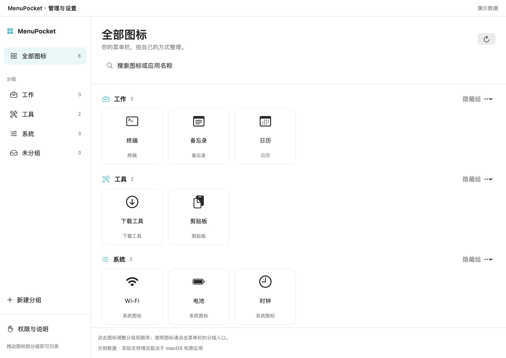
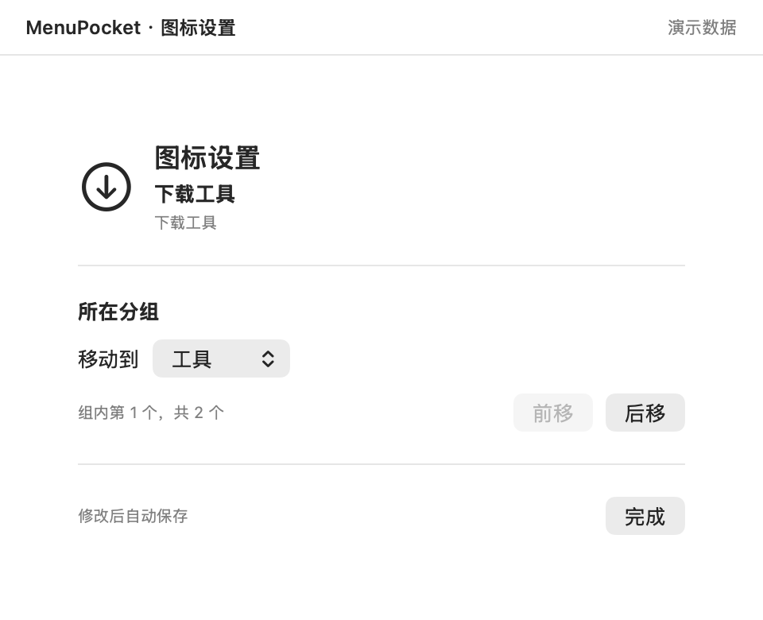
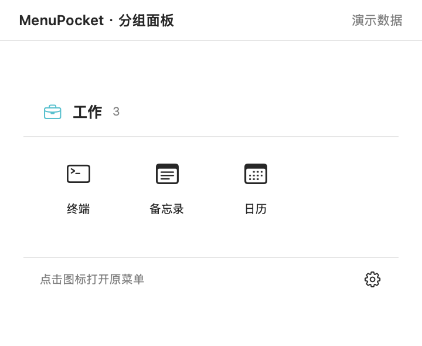

# MenuPocket

[](https://github.com/codeleep/MenuPocket/actions/workflows/ci.yml)


[](LICENSE)

把 macOS 菜单栏图标按用途整理成分组。点击组名打开小面板，管理窗口用于归组和排序。原应用图标保留在菜单栏。

**目前为 Alpha 预览版。** 图标识别和原菜单点击依赖 macOS 与第三方应用的辅助功能支持。项目没有 Apple Developer ID 签名或公证，首次打开可能需要在系统设置中确认。实际兼容情况见 [验证记录](VERIFICATION.md)。

## 1. 能做什么

- 按工作、工具等用途创建、排序和隐藏分组，在菜单栏直接访问分组。
- 点击分组打开小悬浮面板；通过全部入口或 **⌃⌥⌘B** 查看已识别的图标。
- 管理界面点击图标，调整分组和组内顺序，修改自动保存。
- 分组入口可以隐藏和恢复，原应用图标的显示位置不受归组操作影响。
- 配置保存在本机，应用不联网、不上传应用列表或截图。

从 0.3.0-alpha.1 起，移除了原图标隐藏、移动和占位机制。升级会保留已有分组，并在迁移前备份旧配置。

原应用的菜单目前仍显示在它自己的菜单栏位置；没有实现把任意第三方菜单移到分组面板内。

## 2. 界面预览

以下为应用真实 SwiftUI 视图使用隔离演示数据渲染的截图，不是用户桌面截图，也不代表示例应用全部通过兼容性测试。



| 单图标设置 | 日常分组面板 |
| --- | --- |
|  |  |

## 3. 获取应用

**直接安装**：打开 [Releases](https://github.com/codeleep/MenuPocket/releases)，下载 `MenuPocket-版本-macOS-universal.dmg`，打开后将 `MenuPocket.app` 拖入 `Applications`。无需安装开发工具，M 系列和 Intel 使用同一个安装包。首次启动与授权见 [使用教程](docs/USER_GUIDE.md#1-安装与授权)。

**GitHub 云端构建**：进入 [Actions → CI](https://github.com/codeleep/MenuPocket/actions/workflows/ci.yml)，点击 **Run workflow**。构建完成后，从运行页面的 **Artifacts** 下载 Universal 包，支持 Apple Silicon 和 Intel。其他用户可以 Fork 后自行构建，详见 [GitHub 构建与下载步骤](docs/BUILDING.md#6-直接使用-github-构建)。

**本机源码构建**：

需要 macOS、Swift 6 工具链、Python 3；默认稳定本地签名还需要 OpenSSL 3。

```sh
git clone https://github.com/codeleep/MenuPocket.git
cd MenuPocket
bash scripts/build.sh
open dist/MenuPocket.app
```

首次启动后，到「系统设置 → 隐私与安全性 → 辅助功能」授权 MenuPocket。屏幕录制仅用于可选原图标预览，可先不开启。默认构建会创建项目专用签名身份，详细依赖、签名区别和故障处理见 [构建教程](docs/BUILDING.md)。

## 4. 文档

- [使用教程](docs/USER_GUIDE.md)：授权、分组、排序、日常操作与排障。
- [开发与构建](docs/BUILDING.md)：本地签名、双架构构建、测试及打包。
- [版本发布](docs/RELEASING.md)：版本号、CI、标签发布、校验与签名边界。
- [实现结构](docs/ARCHITECTURE.md)、[验证记录](VERIFICATION.md)、[更新日志](CHANGELOG.md)。
- [贡献指南](CONTRIBUTING.md)、[安全报告](SECURITY.md)、[参考与致谢](NOTICE.md)。

## 5. 开发检查

```sh
make check
make test
make ci
```

CI 在 Apple Silicon 和 Intel runner 上构建；通用安装包包含 arm64 与 x86_64。CI 不操作真实用户菜单栏，构建通过不等于兼容性验收。最低部署目标为 macOS 13，原图标截图功能需要 macOS 14；目前真实菜单栏交互主要在 macOS 26.6.2 / Apple Silicon 上验证。

## 6. 许可证

[MIT](LICENSE)，Copyright © 2026 codeleep。
