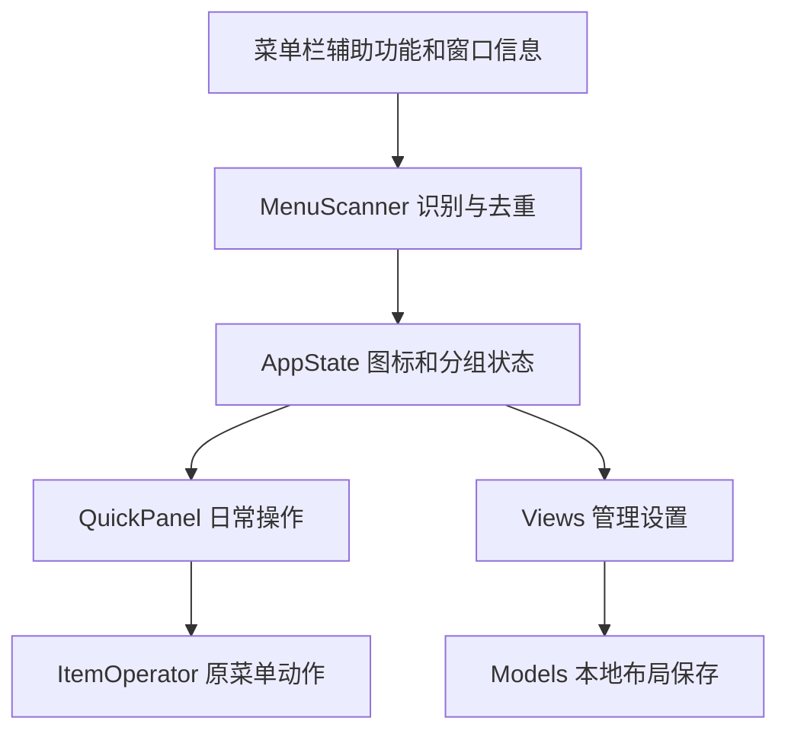

# MenuPocket 实现结构

## 1. 数据与操作流

## 2. 模块职责

| 文件 | 职责 |
| --- | --- |
| `main.swift` | 生命周期、菜单栏分组入口、快捷键、操作编排 |
| `Models.swift` | 分组布局、配置迁移和原子持久化 |
| `AppState.swift` | 可观察状态与管理操作 |
| `MenuScanner.swift` | AX 项目、窗口关联、源应用优先和去重 |
| `ItemOperator.swift` | 辅助功能动作和原图标点击 |
| `Views.swift` / `QuickPanel.swift` | 设置窗口与日常面板 |
| `ThumbnailService.swift` | 可选的单图标窗口预览 |

## 3. 设计边界

本版只管理分组和 MenuPocket 自己的菜单栏入口。原应用图标由原应用与系统管理，项目不再创建占位、模拟 Command 拖动或应用单图标显示偏好。分组调整只更新布局及组入口。

控制中心有时托管第三方图标窗口，进程归属不等于图标归属。扫描优先保留真实源应用，并通过窗口信息去重；旧标识迁移尽量保留分组、顺序与名称。

原生菜单由原应用控制，不进行菜单镜像或强行重定位。安全定位失败时返回错误，不通过启动普通应用窗口假装完成菜单操作。

## 4. 配置和测试

布局以 JSON 保存在 Application Support，损坏或未知版本配置会阻止覆盖原文件。截图工具通过注入临时仓库隔离真实用户数据。模型测试不依赖权限；原菜单点击仍需要人工兼容性验收。

布局版本 2 移除了 `Placement.pinned`。读取版本 1 时先备份原文件，保留分组、组入口状态、归组、顺序和名称，再迁移为版本 2。未知版本或损坏数据不覆盖原文件。
