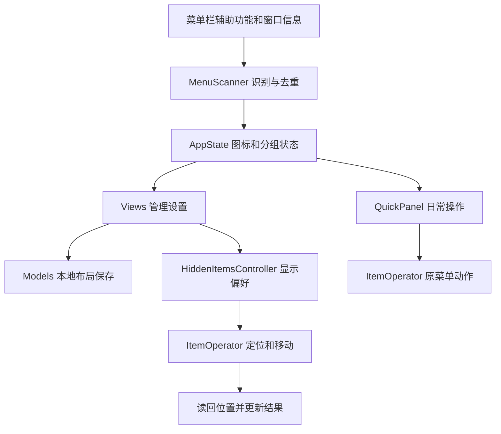

# MenuPocket 实现结构

## 1. 数据与操作流

## 2. 模块职责

| 文件 | 职责 |
| --- | --- |
| `main.swift` | 生命周期、菜单栏分组入口、快捷键、操作编排 |
| `Models.swift` | 布局、偏好、迁移和原子持久化 |
| `AppState.swift` | 可观察状态与管理操作 |
| `MenuScanner.swift` | AX 项目、窗口关联、源应用优先和去重 |
| `HiddenItemsController.swift` | 不可见占位、局部/完整布局、结果校验 |
| `ItemOperator.swift` | 辅助功能动作、命中验证和移动 |
| `Views.swift` / `QuickPanel.swift` | 设置窗口与日常面板 |
| `ThumbnailService.swift` | 可选的单图标窗口预览 |

## 3. 设计边界

macOS 没有本项目可使用的通用公开接口，直接设置任意其他应用单个菜单栏图标的隐藏属性。当前采用不可见占位和经定位校验的移动，把需要隐藏的项目挪到不可见区域。界面不提供旧式竖线、展开或收起边界。

显示偏好与实际结果分开保存和呈现。单项偏好变化只调度当前项目，结构变化才全量布局。移动期间共享占位可能使其他项目短暂露出。

控制中心有时托管第三方图标窗口，进程归属不等于图标归属。扫描优先保留真实源应用，并通过窗口信息去重；旧标识迁移尽量保留分组与偏好。

原生菜单由原应用控制，不进行菜单镜像或强行重定位。安全定位失败时返回错误，不通过启动普通应用窗口假装完成菜单操作。

## 4. 配置和测试

布局以 JSON 保存在 Application Support，损坏或未知版本配置会阻止覆盖原文件。截图工具通过注入临时仓库隔离真实用户数据。模型测试不依赖权限；真实窗口移动仍需要人工兼容性验收。
